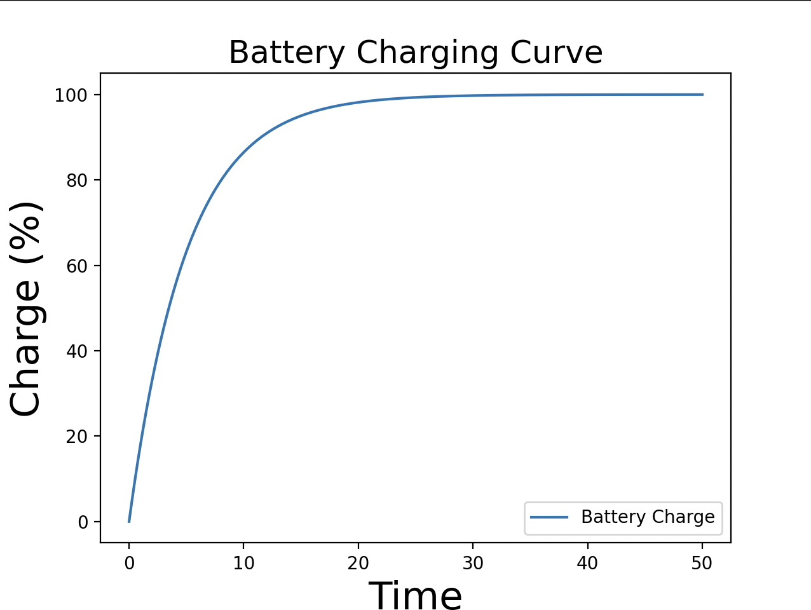
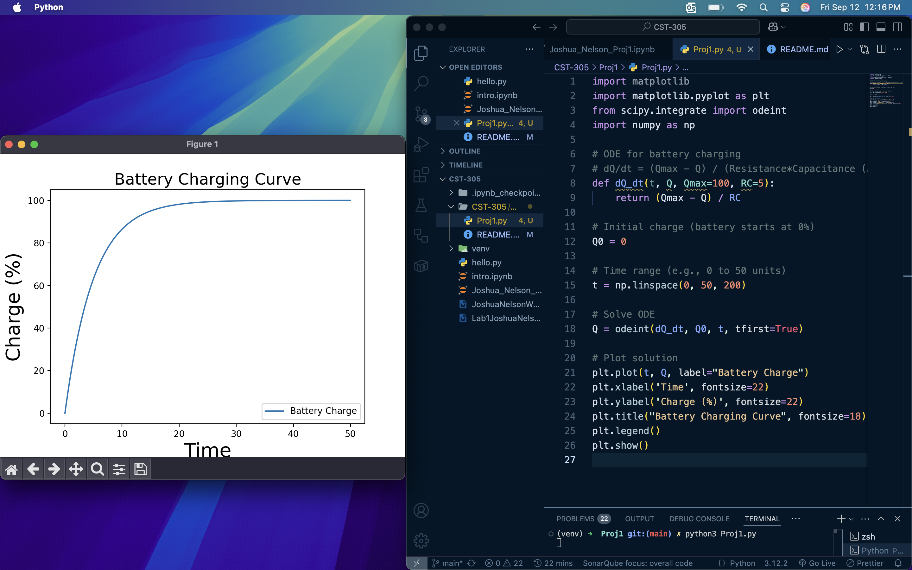

# CST-305: Project 1 – Visualize ODE With SciPy

## Cover Page
**Course:** CST-305 – Computational Modeling and Simulation  
**Project:** Visualizing an ODE for Battery Charging  
**Author(s):** Josh Nelson, Martin Battu, Karik Freiheit

**Due Date:** September 14, 2025

---

## Team Member Responsibilities
| Team Member | Responsibilities | Completed Tasks |
|-------------|-----------------|----------------|
| Josh Nelson      | Implement ODE solver using SciPy | Solved ODE and plotted results |
| Martin Battu      | Documentation and README creation | Compiled documentation and instructions |
| Karik Freiheit      | Code testing and debugging | Verified ODE solution and plot correctness |

---

## System Performance Context
In computer systems, battery performance is critical for portable devices like laptops, tablets, and smartphones. Understanding the charging behavior over time allows engineers to optimize charging circuits, predict battery life, and prevent overcharging.

---

## Specific Problem Solved
The project models battery charging using a first-order ordinary differential equation (ODE). It predicts how the battery charge \( Q(t) \) changes over time as it approaches its maximum capacity \( Q_max \).

---

## Mathematical Approach
The battery charging process is modeled as:  

dQ/dt = (Q_max - Q / (R*C))

Where:  
- \( Q \) = current battery charge (%)  
- \( Q_max \) = maximum battery charge (100%)  
- \( R \) = effective resistance of the charging circuit  
- \( C \) = battery capacitance  
- \( RC \) = time constant of the battery  

This is a linear first-order ODE representing an exponential approach toward full charge.

---

## Implementation Approach
1. **Algorithm Steps:**  
   - Define the ODE function `dQ_dt(t, Q)` for battery charging.  
   - Set initial charge `Q0 = 0`.  
   - Define a time vector for simulation (e.g., 0 to 50 units).  
   - Solve the ODE numerically using `scipy.integrate.odeint`.  
   - Plot the resulting charge vs. time curve using `matplotlib`.

2. **Flowchart:**
# INSERT FLOWCHART HERE


---

## Screenshots
*(Insert images here after running the program)*  

- Example plot of battery charging curve:
  

---

## References
1. SciPy documentation – [https://docs.scipy.org/doc/scipy/reference/generated/scipy.integrate.odeint.html](https://docs.scipy.org/doc/scipy/reference/generated/scipy.integrate.odeint.html)  
2. Matplotlib documentation – [https://matplotlib.org/stable/contents.html](https://matplotlib.org/stable/contents.html)  
3. Bronson, R. and Costa, G. (2022). Schaum's outline of differential equations (5th ed.). McGraw-Hill: New York, NY

---

## Installation and Running Instructions

1. **Prerequisites:**  
   - Python 3.x installed on your system  
   - `numpy`, `scipy`, and `matplotlib` packages  
   - If this doesn't work, use a virtual environment with venv

2. **Installation via pip:**
```bash
pip install numpy scipy matplotlib
```
3. **Running the Program (If on mac, run with python3)**
```
python battery_charging.py
```

- Proof of Code Running:
  


